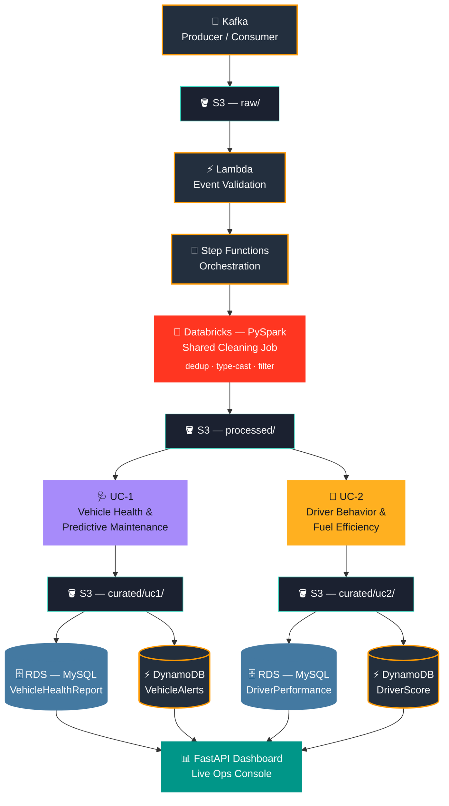
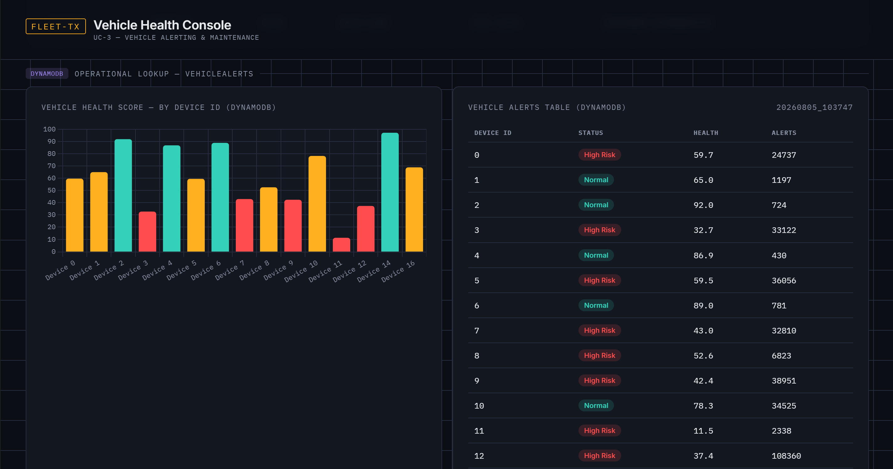
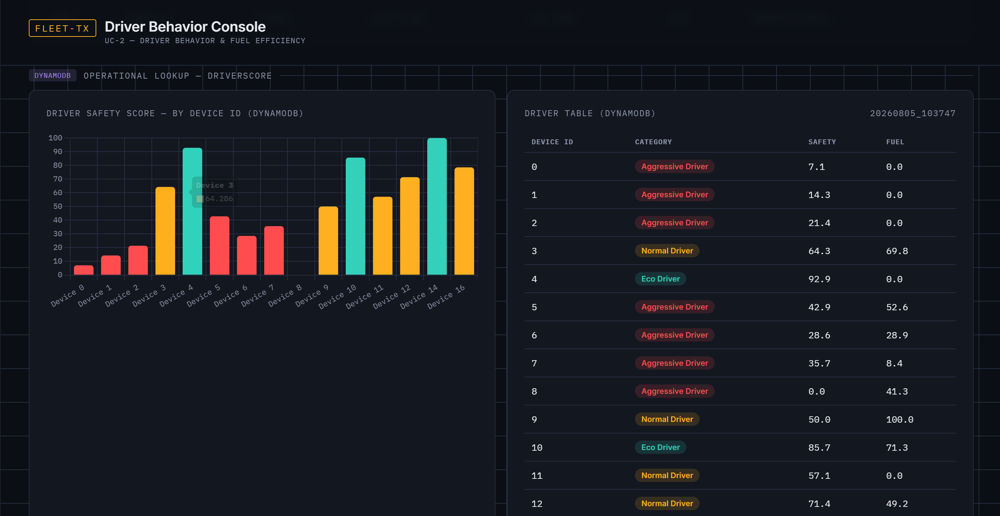

<div align="center">

# 🚛 Fleet Telematics

### IoT Sensor Data Analytics Pipeline for Fleet Operations

*A cloud-native, end-to-end streaming analytics platform · Kafka → S3 → Databricks → RDS/DynamoDB → Live Dashboard*

<br>

[](https://aws.amazon.com/)
[](https://databricks.com/)
[](https://kafka.apache.org/)
[](https://spark.apache.org/)
[](https://fastapi.tiangolo.com/)
[](https://www.mysql.com/)

<br>

[Overview](#-overview) · [Architecture](#️-architecture) · [Ownership](#-ownership) · [UC-1](#-uc-1--vehicle-health--predictive-maintenance) · [UC-2](#-uc-2--driver-behavior--fuel-efficiency) · [Dashboard](#-dashboard) · [Setup](#-getting-started) · [Findings](#-notable-engineering-decisions--findings)

</div>

<br>

## 📋 Overview

Two engineers, one shared platform, two independently owned business use cases — mirroring how real data engineering teams split ownership while integrating on common infrastructure.

Vehicle telemetry (speed, RPM, engine temperature, fuel efficiency, and more) streams through Kafka, lands in an S3 data lake, gets cleaned and validated with PySpark on Databricks, and feeds two parallel analytics pipelines: **driver behavior scoring** and **vehicle health monitoring**. Results are queryable from both a relational store (RDS) and a fast key-value store (DynamoDB), and visualized in a live operations dashboard.

<br>

<div align="center">

| | |
|:---:|:---:|
| 👥 **Team** | 2 engineers |
| 🌐 **Domain** | IoT · Cloud · Big Data |
| 📊 **Dataset** | [Levin Vehicle Telematics](https://www.kaggle.com/datasets/yunlevin/levin-vehicle-telematics) — 3.1M+ rows |
| 📍 **Region** | ap-south-1 (Mumbai) |

</div>

<br>

## 🏗️ Architecture



<br>

## 👥 Ownership

Per the project's individual-accountability model — shared platform built together, one use case owned end-to-end by each engineer, cross-reviewed before integration.

<div align="center">

| Component | Owner | Reviewer |
|:---|:---:|:---:|
| Shared platform *(Kafka, S3, Lambda, Step Functions, Databricks cleaning, common tables)* | 🤝 Both | 🤝 Both |
| 🩺 **UC-1 — Vehicle Health & Predictive Maintenance** | Engineer 1 | Engineer 2 |
| 🚗 **UC-2 — Driver Behavior & Fuel Efficiency** | Engineer 2 | Engineer 1 |
| Integration & final testing | 🤝 Both | 🤝 Both |

</div>

<br>

## 🩺 UC-1 — Vehicle Health & Predictive Maintenance

Flags potential mechanical issues before they become breakdowns.

<div align="center">

| Detection | Rule | Statistical Basis |
|:---|:---|:---|
| High RPM | `rpm > 2000` | ~p95 of RPM distribution |
| Engine overheating | `cTemp > 91°C`, excluding cold-start zeros | ~p90–p95 |
| Excessive engine load | `eLoad > 81`, excluding idle zeros | ~p95 |
| Low battery voltage | `battery < 12.0V`, excluding sensor-inactive zeros | 12V automotive convention + bottom ~0.3% of real readings |
| Frequent DTC events | `dtc > 0` | ⚠️ Fires on only 71 of 3.1M rows (0.002%) — logic correct, signal genuinely sparse |

</div>

**Outputs:** Vehicle Health Score · High-Risk Vehicle Flag · Rule-Based Maintenance Recommendation · Alert Summary

<br>

## 🚗 UC-2 — Driver Behavior & Fuel Efficiency

Detects five driving behavior signals from real-time telemetry, using **evidence-based thresholds** derived from profiling the actual 3.1M-row dataset rather than guessed values.

<div align="center">

| Detection | Rule | Statistical Basis |
|:---|:---|:---|
| High RPM | `rpm > 2000` | ~p95 of RPM distribution |
| Rapid acceleration | `Δspeed > 5 km/h` in 1 second | ~p99 of positive speed deltas |
| Hard braking | `Δspeed < -6 km/h` in 1 second | ~p01 of speed deltas |
| Poor fuel efficiency | `kpl < 1.2` while moving | ~p25 of efficiency, excluding idle |
| **Aggressive driving** | 2+ signals firing on the same reading | Composite — a single event isn't "aggressive," a pattern is |

</div>

> **Scoring design note:** Driver Safety Score uses **relative percentile ranking** within the fleet rather than a fixed absolute penalty. At ~1-second sampling density, even genuinely risky drivers' events are a tiny fraction of total readings — a fixed penalty formula compresses everyone toward 100. Percentile rank instead guarantees meaningful score spread across the fleet regardless of absolute event rarity.

**Outputs:** Driver Safety Score · Fuel Efficiency Score · Driver Ranking · Category (Eco / Normal / Aggressive)

<br>

## 📊 Dashboard

Live operations console built with FastAPI + Chart.js — dual-source view comparing the same computed scores across **RDS** (historical/analytical) and **DynamoDB** (fast operational lookup).

<!--
  Drop dashboard screenshots into: dashboard/screenshots/
  Then uncomment the image lines below.
-->

<div align="center">

<table>
<tr>
<td align="center" width="50%">
<b>Vehicle Alert — DynamoDB Comparison</b><br><br>

<i>📸 Screenshot placeholder — <code>dashboard/screenshots/vehicle-alert.png</code></i>
</td>
<td align="center" width="50%">
<b>Driver Behavior — DynamoDB Comparison</b><br><br>

<i>📸 Screenshot placeholder — <code>dashboard/screenshots/driver-dynamo.png</code></i>
</td>
</tr>
</table>

</div>

<br>

## 🛠️ Tech Stack

<div align="center">

| Layer | Technology |
|:---|:---|
| **Ingestion** | Apache Kafka (KRaft mode, Docker) |
| **Storage** | Amazon S3 — `raw/` · `processed/` · `curated/` · `reports/` |
| **Orchestration** | AWS Step Functions · AWS Lambda |
| **Processing** | Databricks · PySpark 3.5.x |
| **Databases** | Amazon RDS (MySQL) · Amazon DynamoDB |
| **Dashboard** | FastAPI · Jinja2 · Chart.js |
| **Automation** | Boto3 · Python 3.11 |
| **Access Control** | IAM — least-privilege, per-engineer scoped users |

</div>

<br>

## 🚀 Getting Started

```bash
# 1 · Clone and set up environment
git clone https://github.com/Ashutosh-Anand-1018/Fleet-Telematics.git
cd Fleet-Telematics
python3.11 -m venv venv
source venv/bin/activate
pip install -r requirements.txt

# 2 · Configure environment variables
cp .env.example .env   # fill in AWS, Kafka, RDS, Databricks credentials

# 3 · Bring up local Kafka
cd docker && docker compose up -d && cd ..

# 4 · Run the dashboard
pip install fastapi uvicorn jinja2
uvicorn dashboard.app:app --reload --port 8000
# → open http://localhost:8000
```

Databricks notebooks (`databricks/`) run on a Databricks cluster with S3 cross-account access configured via Databricks Secrets — see `configure_s3_credentials.py` for details.

<br>

## 📁 Repository Structure

```
Fleet-Telematics/
├── common/               Shared boto3 helpers, Kafka config
├── databricks/            PySpark notebooks — cleaning + both use cases
├── dashboard/               FastAPI live ops console
│   ├── app.py
│   ├── templates/
│   └── screenshots/           ← dashboard screenshots go here
├── sql/                        RDS table DDL
├── scripts/                      Local utility & test scripts
├── streaming/                      Kafka producer/consumer
├── lambda/                           Lambda functions
├── docs/                                Architecture diagrams, build notes
└── docker/                                Kafka docker-compose setup
```

<br>

## 📝 Notable Engineering Decisions & Findings

Documented honestly, including things that didn't go as expected — treated as evidence of process, not hidden.

- 🔍 **Embedded header rows** — the source CSV contains 33 duplicated header rows scattered through the file (signature of concatenated source files); required explicit filtering beyond standard null-handling.
- 🔁 **Exact duplicates** — ~27% of rows in early testing were byte-identical duplicates (verified, not distinct sub-second readings) — safe to drop via full-row dedup.
- 🔐 **Cross-account Databricks access** — compute (Databricks workspace) and storage (S3/RDS) live in different AWS accounts; resolved via explicit IAM credentials through Databricks Secrets rather than instance profiles.
- 📉 **DTC sparsity** — "frequent DTC events" detection is logically correct, but the real dataset exercises it on only 0.002% of rows — a genuine data characteristic, not a bug.
- ⚠️ **RDS capacity** — hit an `insufficient-capacity` error on `db.t4g.micro`; resolved by switching to `db.t3.micro` with an explicit Availability Zone.

<br>

<div align="center">

---

*Built as part of the BridgeLabz AWS Data Engineering Fellowship*

</div>
